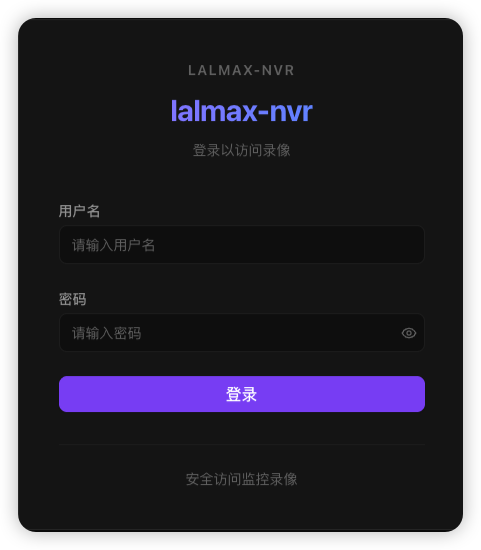
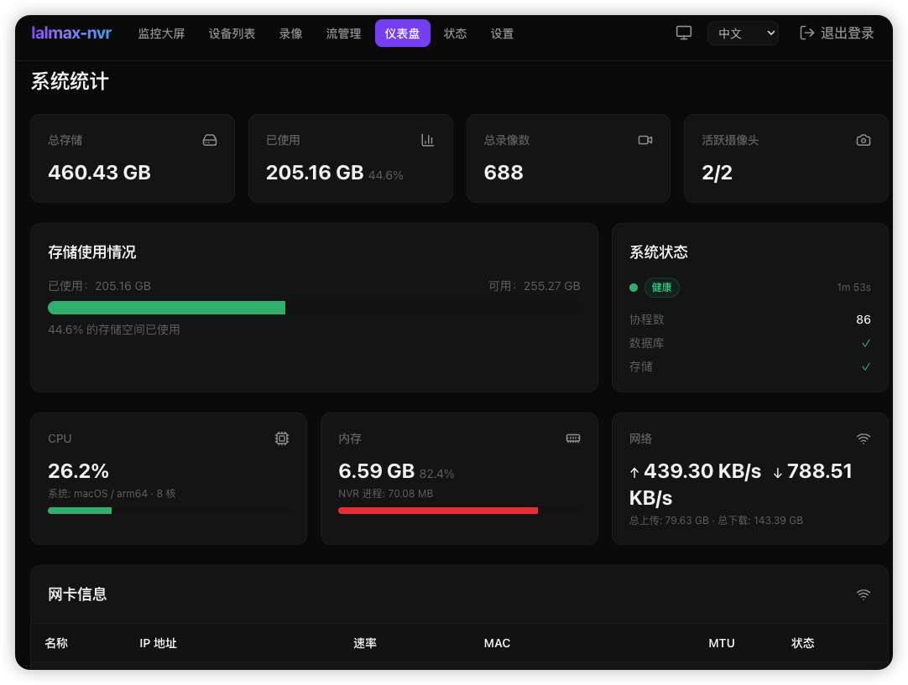
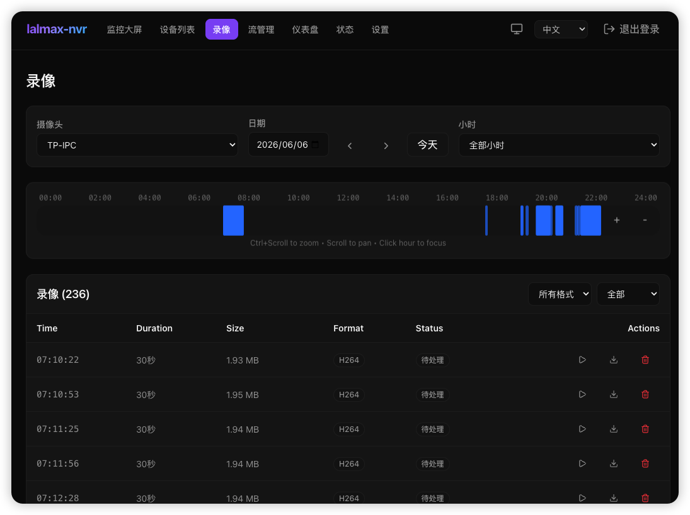
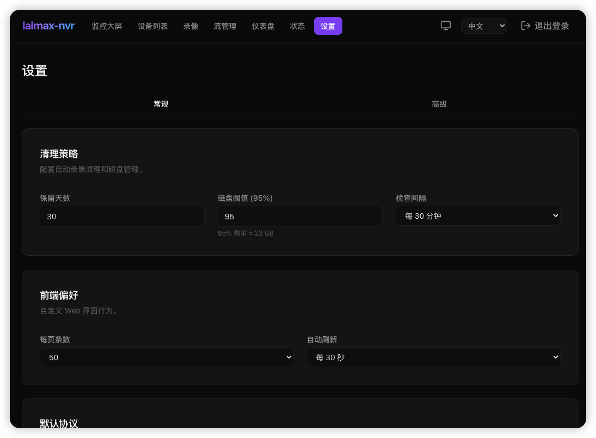

# lalmax-nvr

[](https://github.com/lalmax-pro/lalmax-nvr/releases)
[](https://github.com/lalmax-pro/lalmax-nvr/actions/workflows/ci.yml)
[](https://go.dev/)
[](https://svelte.dev/)
[](https://www.sqlite.org/)
[](https://www.docker.com/)
[](https://www.raspberrypi.com/)
[](LICENSE)

基于 [lalmax](https://github.com/q191201771/lal) 媒体引擎构建的轻量级网络视频录像机。单文件部署，零依赖——专为树莓派及低功耗设备设计。

这个项目最初受到 MiBeeNVR 的启发，后续已经演进为一个面向 `lal` / `lalmax` 媒体体系的专属 NVR 项目。

[**English**](README.md)

## 截图






## 架构

lalmax-nvr 采用两层架构：

```
摄像头 ──→ lalmax（媒体引擎） ──→ HLS / HTTP-FLV / WebRTC / fMP4 播放
                │
                └──→ 录像（H264/H265 MP4 切片）
```

- **lalmax** 负责媒体中继、协议转换和流分发
- **NVR 层** 负责摄像头生命周期、ONVIF 信令、录像、存储和 Web UI
- `media.enabled=true` 时，所有 H264/H265 流都经过 lalmax——无重复拉流

## 流媒体协议

| 协议 | 延迟 | 后端 | 编码支持 |
|------|------|------|----------|
| **WebCodecs**（WebSocket） | <100ms | 内置 WS | H.264, H.265 |
| **fMP4**（MSE） | ~200ms | lalmax | H.264, H.265 |
| **WebRTC**（WHEP） | ~300ms | lalmax | H.264 |
| **HTTP-FLV** | ~500ms | lalmax | H.264, H.265 |
| **HLS** / **LL-HLS** | 1-3s | lalmax | H.264, H.265 |

## 核心功能

- **媒体引擎**：基于 lalmax 的统一中继——摄录分离，无重复拉流
- **摄像头协议**：RTSP（H.264/H.265/MJPEG）、HTTP JPEG、ONVIF 设备发现与管理
- **国标 GB28181**：完整的 SIP 设备管理、级联平台支持、录像查询与回放（带时间轴）、多协议流媒体（ws-flv、flv、hls、webrtc 等）、播放控制（暂停/恢复/倍速/拖动）、批量下载、平台事件历史、语音对讲（SIP INVITE，UDP/TCP）
- **视频录像**：自动 MP4 切片、多摄像头并发、按摄像头设置保留天数、音频录制（AAC + G.711）
- **录像回放**：24小时可视化时间轴、小时级缩放、内联播放器、鼠标滚轮缩放/平移
- **实时直播**：多协议——WebCodecs、fMP4、WebRTC、HTTP-FLV、HLS、LL-HLS
- **RTMP/SRT 接入**：接收摄像头或编码器推送的流
- **片段合并**：自动/手动合并，全局 + 按摄像头策略
- **ONVIF**：设备发现、云台控制、成像设置、流地址解析、编码自动检测
- **流管理**：运行时流清单、摄像头绑定、流提升
- **Web 界面**：深色/浅色主题、响应式、中英文切换、Chart.js 图表
- **智能家居**：MQTT 触发录像、WebDAV/FTP 文件访问
- **健康监控**：多层摄像头健康检测、自动修复、质量评分
- **单文件部署**：零依赖、内嵌前端、`CGO_ENABLED=0`
- **小米摄像头**：CS2 P2P 协议、云端认证（社区驱动）

## 快速开始

### 方式 1：Docker

```bash
docker compose up -d
```

打开 `http://localhost:9090`，在浏览器中完成设置向导。

详见 [`docker-compose.yml`](docker-compose.yml)。

### 方式 2：源码编译

```bash
git clone https://github.com/lalmax-pro/lalmax-nvr.git
cd lalmax-nvr
./scripts/unix/build.sh
./scripts/unix/start.sh
```

打开 `http://localhost:9090`。

其他脚本：

```bash
./scripts/unix/stop.sh        # 停止后台进程
./scripts/unix/restart.sh     # 重启
./scripts/unix/status.sh      # 查看 PID 和健康检查
./scripts/unix/logs.sh        # 查看日志
./scripts/unix/run.sh         # 前台运行
./scripts/unix/test.sh        # 运行所有 Go 测试
```

详见 [`scripts/README.md`](scripts/README.md) 了解环境变量覆盖。

## 配置

媒体引擎关键配置：

```yaml
media:
  enabled: true    # 启用 lalmax 中继（推荐）
```

`media.enabled=true` 时：
- 所有 H264/H265 RTSP/ONVIF 摄像头通过 lalmax 拉流
- HLS/FLV/WebRTC/fMP4 播放由 lalmax 提供
- 录像消费 lalmax 统一流
- MJPEG 和 HTTP/JPEG 摄像头仍直连（lalmax 限制）

完整配置参考请见 [配置说明](docs/zh/configuration.md)。

## 文档

| 文档 | 说明 |
|------|------|
| [快速入门](docs/zh/getting-started.md) | 安装、添加第一个摄像头 |
| [配置说明](docs/zh/configuration.md) | 完整配置参考 |
| [API 文档](docs/zh/api-reference.md) | REST API 接口文档 |
| [ONVIF 指南](docs/zh/onvif-guide.md) | ONVIF 摄像头设置、云台控制 |
| [摄像头指南](docs/zh/camera-guide.md) | 摄像头协议设置 |
| [流管理](docs/zh/stream-management-design.md) | 运行时流清单和绑定 |
| [部署指南](docs/zh/deployment.md) | 反向代理、交叉编译 |
| [转码](docs/zh/transcoding.md) | FFmpeg 转码设置 |
| [MQTT 集成](docs/zh/mqtt-integration.md) | MQTT 触发录像 |
| [WebDAV 集成](docs/zh/webdav-integration.md) | WebDAV 文件访问 |
| [故障排除](docs/zh/troubleshooting.md) | 常见问题及解决方案 |

## 项目结构

```
cmd/lalmax-nvr/        # 程序入口
internal/              # 核心模块
  ai/                  # AI 推理
  api/                 # REST API + 流代理
  camera/              # 摄像头生命周期管理
  cleanup/             # 数据清理任务
  config/              # YAML 配置
  event/               # 事件总线
  flv/                 # HTTP-FLV 直播管理器
  ftp/                 # FTP 服务
  health/              # 摄像头健康监控
  hls/                 # HLS 直播管理器
  media/               # lalmax 引擎适配器
  merge/               # 片段合并管理器
  metrics/             # Prometheus 指标
  middleware/           # HTTP 中间件
  model/               # 数据模型
  mqtt/                # MQTT 客户端
  muxer/               # MP4 封装器
  onvif/               # ONVIF 客户端（发现、云台、成像）
  recorder/            # H264/H265/MJPEG/HTTP-JPEG 录像引擎
  rtmp/                # RTMP 接入服务器
  srt/                 # SRT 接收器
  storage/             # SQLite 数据库 + 文件管理
  timelapse/           # 延时摄影生成
  transcoding/         # FFmpeg 转码队列
  ui/                  # 内嵌 SPA 静态文件
  upload/              # 文件上传处理
  webdav/              # WebDAV 服务
  webrtc/              # WebRTC WHEP 管理器
  wsstream/            # WebSocket 流管理器（WebCodecs）
  xiaomi/              # 小米摄像头支持
scripts/               # 构建和管理脚本
third/
  lal/                 # lal 媒体库（vendored）
  lalmax/              # lalmax 扩展（vendored）
web/                   # Svelte 5 前端
docs/                  # 文档（中文/英文）
deploy/                # 部署配置（Caddy、Grafana 等）
```

## 贡献

1. 提交前运行 `go vet ./...`
2. 新功能附带测试
3. 清晰的提交信息

## 许可证

[MIT License](LICENSE)
